# FastAPI_meiyume

1. Install required modules

```
pip3 install -r requirements.txt
```

2. Edit .env file and change the values to your AWS credentials

3. Start local api server by running:

```
uvicorn fastapi_APIs:app --reload
```

# The Goal of this Manual

This manual is about how to use the Meiyume data APIs.
There are two files you need to know about the APIs and how to call the APIs:

1. requirements.txt => This is used to install the packages you need

2. fastapi_APIs.py => The file you need to run to support the APIs
   You will need to run a local server through all the data APIs that can be fetched. Then you can get all the data you need through RestAPI and all the data are returned in JSON format. The script is to be run in the Remote Desktop environment.

   In short:
   There are only two commands you need to run. The first command is to run only once for the setup. The second is the one you need for the development purpose.

3. `pip install -r requirements.txt`

4. `uvicorn fastapi_APIs:app --reload`

# Set up the environment and make it run

First of all, you need to set up the environment by installing the packages you need:

1. cd to the folder where you save the two files above, as the screenshot shows, they are in D:\Max\FastAPI for example:

   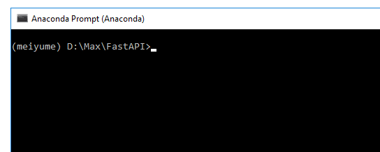
   The terminal is the Anaconda Prompt terminal.
   How to install the Anaconda? Please refer to this tutorial:
   https://docs.anaconda.com/anaconda/install/
   After you installed the Anaconda, open the Anaconda Prompt terminal in search:

   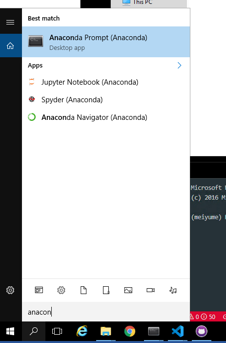
   If you are using Mac, you can find it in a global search.

2. Install the packages by running this command in the Anaconda Prompt terminal:
   `pip install -r requirements.txt`

   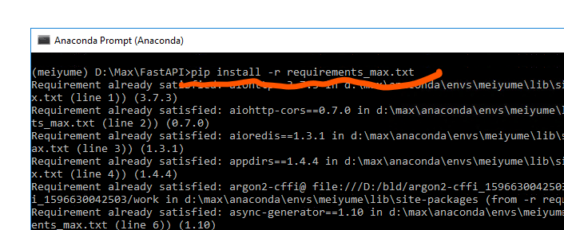

3. You can run the unicorn server to make all the APIs work by running the command:
   `uvicorn fastapi_APIs:app --reload`

   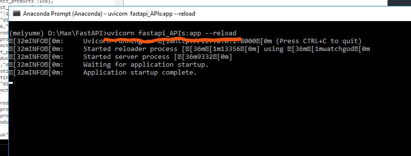

By now, you have all the APIs working on your local server. And you can see from the terminal (as above)

# Check the APIs on Swagger UI

To check all the APIs in Swagger UI, you can go to the Swagger page through:
http://127.0.0.1:8000/docs

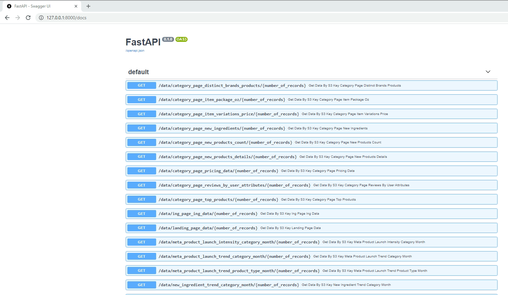

If you want to check a particular API, you can use Try it out and Execute to see what the response will look like:

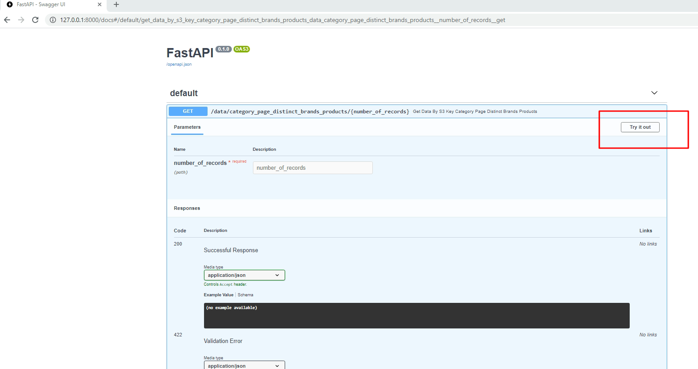

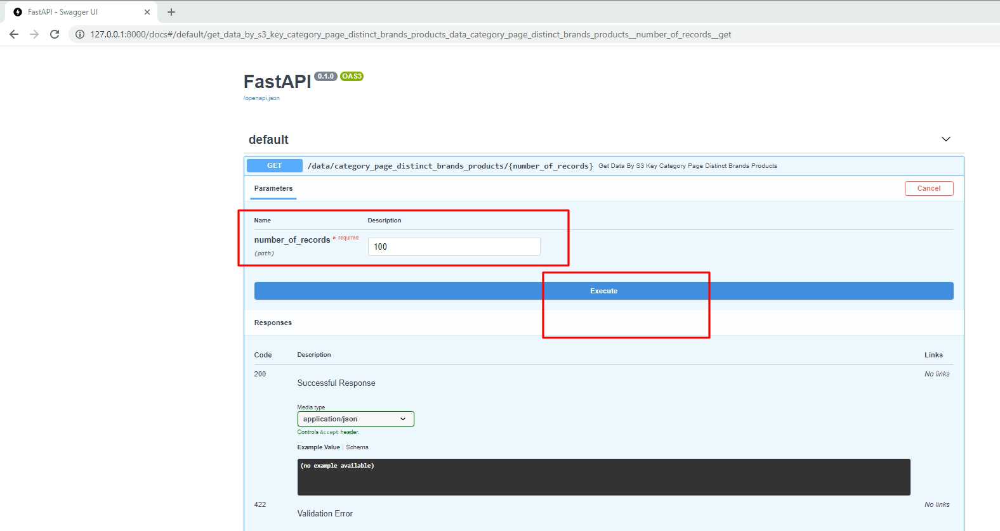

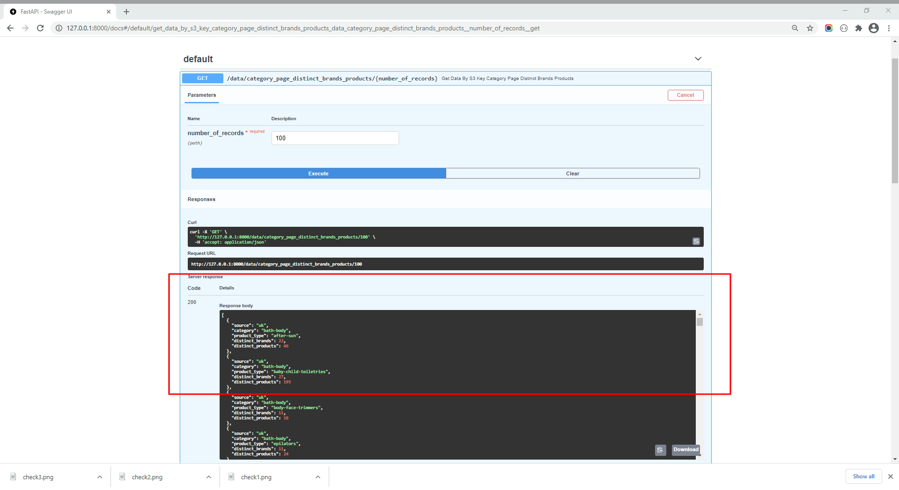

If you are checking all the records:
the fielf of number_of_records should be "all", shown as below

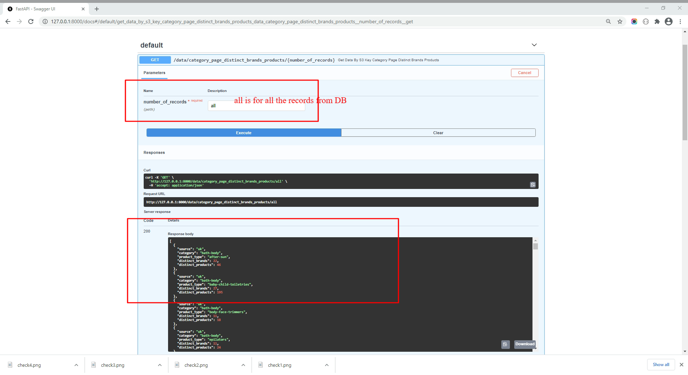

# Check the JSON response on the browser

If you want to check the response of a particular API in the browser, you can check it directly through the link: (The link on the URL is the one listed on the Swagger UI page).

Here is an example of /data/category_page_distinct_brands_products:
http://127.0.0.1:8000/data/review_trend_by_marketing_category_month/10

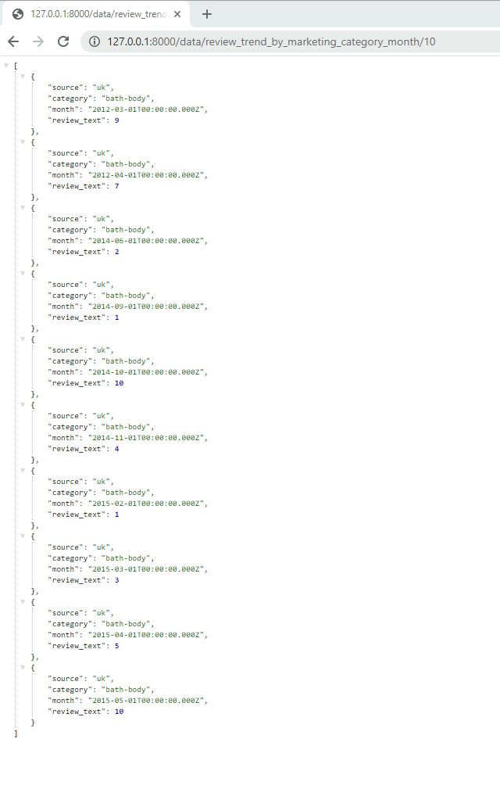

If you are checking the full records, here is the link:
http://127.0.0.1:8000/data/review_trend_by_marketing_category_month/all

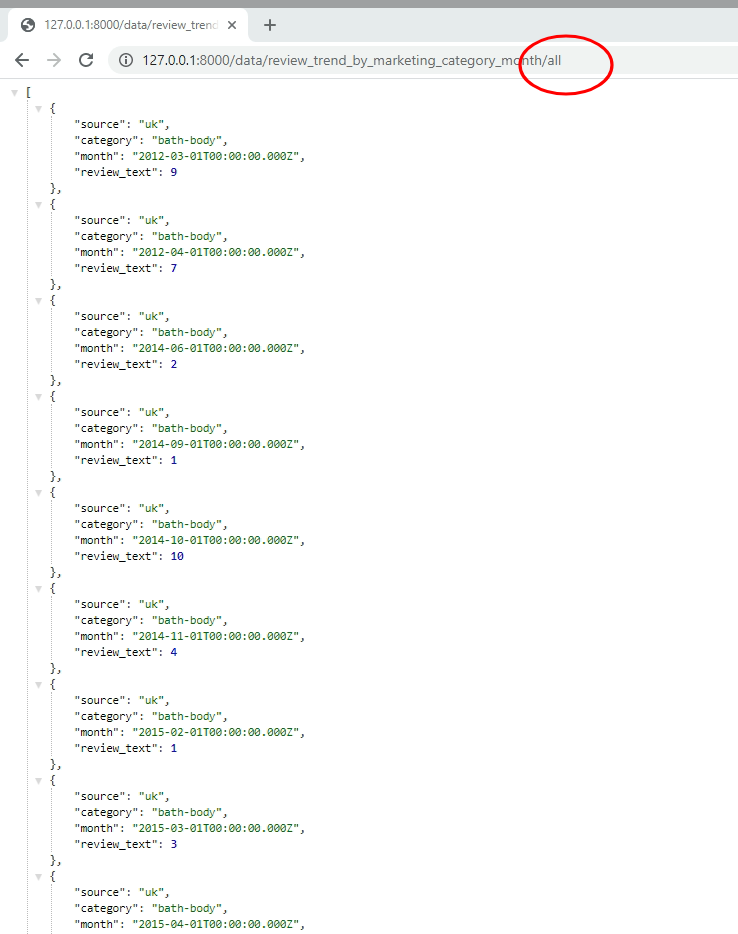

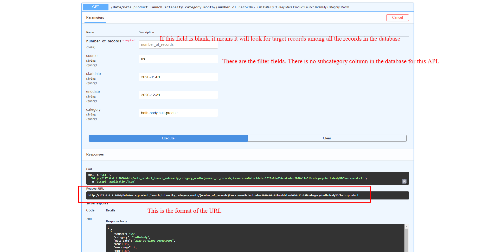
